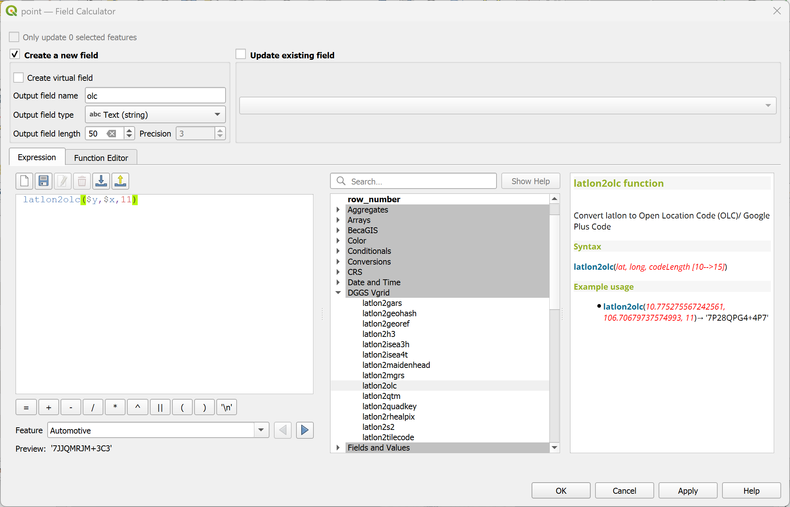
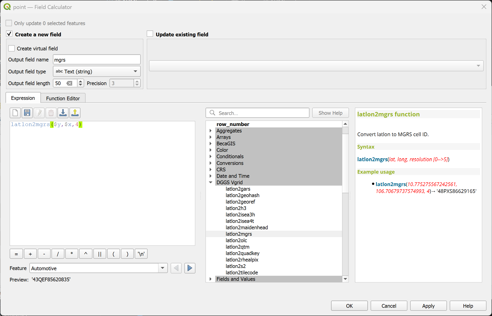
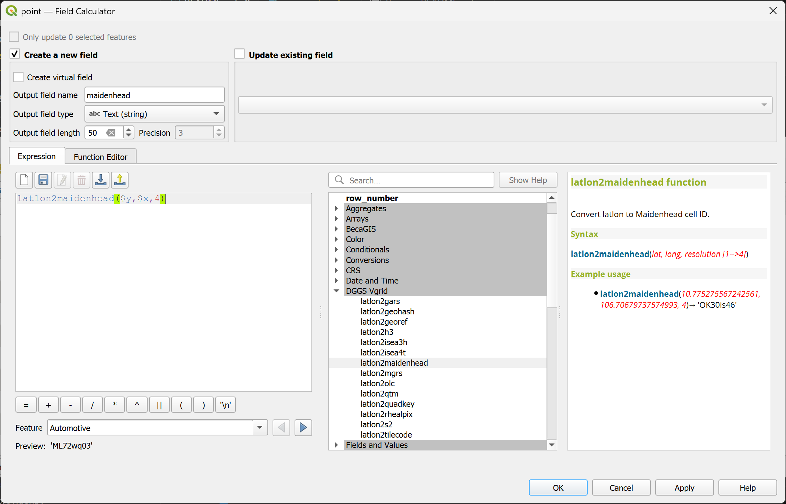

<!-- PROJECT LOGO -->

    
  <h3 align="center">Vgrid</h3>
  

    <b><i>Vgrid Tools for QGIS</i><b>
     
  

## Descriptions
<!-- TABLE OF CONTENTS -->

  
Vgrid Tools for QGIS

  

  

  <ol>
      <li>  
      <a href="#expressions">Expressions</a>     
      <ul>
        <li><a href="#latlon2olc">latlon2olc</a></li>
        <li><a href="#latlon2mgrs">latlon2mgrs</a></li>
        <li><a href="#latlon2geohash">latlon2geohash</a></li>
        <li><a href="#latlon2georef">latlon2georef</a></li>
        <li><a href="#latlon2s2">latlon2s2</a></li>
        <li><a href="#latlon2vcode">latlon2vcode</a></li>
        <li><a href="#latlon2maidenhead">latlon2maidenhead</a></li>
        <li><a href="#latlon2gars">latlon2gars</a></li>
      </ul>
  </ol>

## Expressions

### latlon2olc

Convert LatLon to Open Location Code (OLC)/ Google Plus Code.
<h4>Syntax</h4>
<li>
<code>latlon2olc(lat, long, codeLength [10-->15])  or latlon2olc($y, $x, codeLength) in WGS84 CRS</code>
</li> 
<h4>Example usage</h4>
<li>s
<code> latlon2olc(10.775275567242561, 106.70679737574993, 11) → '7P28QPG4+4P7'</code>
</li>
 

  

### latlon2mgrs

Convert LatLon to MGRS Code.
<h4>Syntax</h4>
<li>
<code>latlon2mgrs(lat, long, resolution [0-->5]) or latlon2mgrs($y, $x, resolution) in WGS84 CRS</code>
</li> 
<h4>Example usage</h4>
<li>
<code> latlon2mgrs(10.775275567242561, 106.70679737574993, 4)→ '48PXS86629165'</code>
</li>
 

  

### latlon2geohash

Convert LatLon to Geohash Code.
<h4>Syntax</h4>
<li>
<code>latlon2geohash(lat, long, resolution [1-->30]) or latlon2geohash($y, $x, resolution) in WGS84 CRS</code>
</li> 
<h4>Example usage</h4>
<li>
<code>latlon2geohash(10.775275567242561, 106.70679737574993, 9)→ 'w3gvk1td8'</code>
</li>
 

  

### latlon2georef

Convert LatLon to GEOREF Code.
<h4>Syntax</h4>
<li>
<code>latlon2georef(lat, long, resolution [0-->10]) or latlon2georef($y, $x, resolution) in WGS84 CRS</code>
</li> 
<h4>Example usage</h4>
<li>
<code>latlon2georef(10.775275567242561, 106.70679737574993, 5)→ 'VGBL4240746516'</code>
</li>
 

  

### latlon2s2

Convert LatLon to S2 Code.
<h4>Syntax</h4>
<li>
<code>latlon2s2(lat, long, resolution [0-->30]) or latlon2s2($y, $x, resolution) in WGS84 CRS</code>
</li> 
<h4>Example usage</h4>
<li>
<code>latlon2s2(10.775275567242561, 106.70679737574993, 21)→ '31752f45cc94'</code>
</li>
 

  

### latlon2vcode

Convert LatLon to Vcode.
<h4>Syntax</h4>
<li>
<code>latlon2vcode(lat, long, resolution/ zoom level [0;25])  or latlon2vcode($y, $x, resolution/ zoom level) in WGS84 CRS</code>
</li> 
<h4>Example usage</h4>
<li>
<code>latlon2vcode(10.775275567242561, 106.70679737574993, 23)→ 'z23x6680752y3941728'</code>
</li>
 

  

### latlon2maidenhead

Convert LatLon to Maidenhead Code.
<h4>Syntax</h4>
<li>
<code>latlon2maidenhead(lat, long, resolution [1-->4]) or latlon2maidenhead($y, $x, resolution) in WGS84 CRS</code>
</li> 
<h4>Example usage</h4>
<li>
<code>latlon2maidenhead(10.775275567242561, 106.70679737574993, 4)→ 'OK30is46' </code>
</li>
 

  

### latlon2gars

Convert LatLon to GARS Code.
<h4>Syntax</h4>
<li>
<code>latlon2gars(lat, long, resolution [1, 5, 15, 30 (minutes)]) or latlon2gars($y, $x, resolution) in WGS84 CRS</code>
</li> 
<h4>Example usage</h4>
<li>
<code>latlon2gars(10.775275567242561, 106.70679737574993, 1)→ '574JK1918'</code>
</li>
 

  

