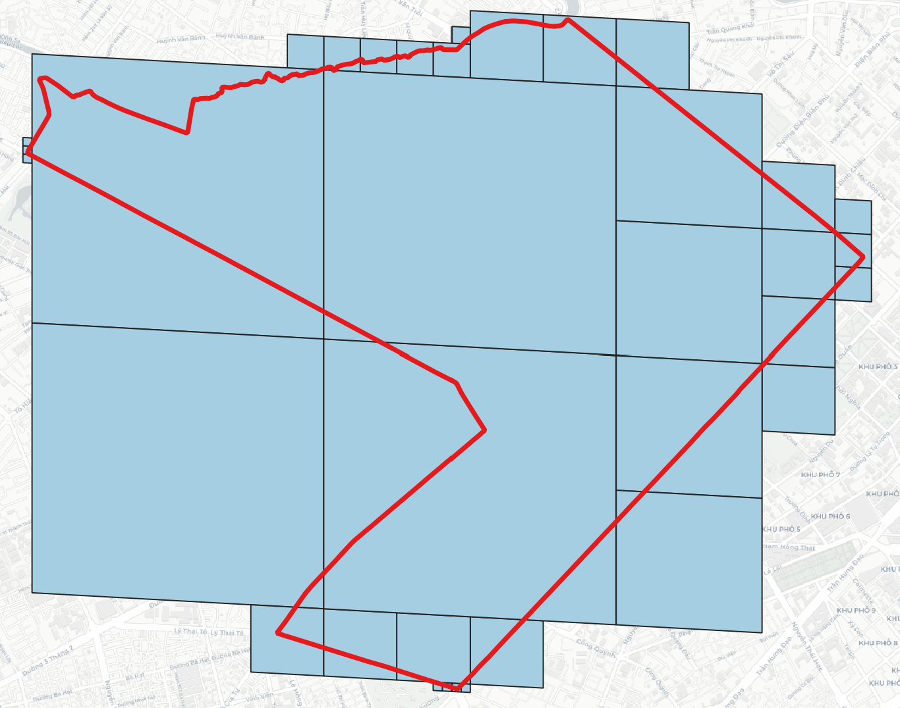

<!-- PROJECT LOGO -->
<p align="center">
  <h3 align="center">Vgridtools</h3>
  <p align="center">
    <b><i>Vgrid DGGS Tools for QGIS</i><b>
    <br />
  </p>
</p>
<div align="center">
  
</div>

[](https://opensource.org/licenses/MIT)

<!-- TABLE OF CONTENTS -->
<details open="open">
  <summary>Vgrid DGGS Tools for QGIS</summary>  
  <ol>
    <li>
      <a href="#vgridtools-installation">Vgridtools installation</a>     
    </li>
    <li>
      <a href="#dggs-conversion">DGGS Conversion</a>
      <ul>
        <li><a href="#cell-id-to-dggs">Cell ID to DGGS</a></li>
        <li><a href="#vector-to-dggs">Vector to DGGS</a></li>
        <li><a href="#raster-to-dggs">Raster to DGGS</a></li>
        <li><a href="#dggs-compact">DGGS Compact</a></li>
        <li><a href="#dggs-expand">DGGS Expand</a></li>
      </ul>
        <li><a href="#dggs-binning">DGGS Binning</a></li>
        <li><a href="#dggs-resampling">DGGS Resampling</a></li>
        <li><a href="#dggs-generator">DGGS Generator</a></li>
    </li>
    <li>
      <a href="#expressions">Expressions</a>
      <ul>
        <li><a href="#latlon2h3">latlon2h3</a></li>
        <li><a href="#latlon2s2">latlon2s2</a></li>
        <li><a href="#latlon2rhealpix">latlon2rhealpix</a></li>
        <li><a href="#latlon2isea4t">latlon2isea4t</a></li>
        <li><a href="#latlon2isea3h">latlon2isea3h</a></li>
        <li><a href="#latlon2qtm">latlon2qtm</a></li>
        <li><a href="#latlon2olc">latlon2olc</a></li>
        <li><a href="#latlon2geohash">latlon2geohash</a></li>
        <li><a href="#latlon2georef">latlon2georef</a></li>
        <li><a href="#latlon2mgrs">latlon2mgrs</a></li>
        <li><a href="#latlon2tilecode">latlon2tilecode</a></li>
        <li><a href="#latlon2quadkey">latlon2quadkey</a></li>
        <li><a href="#latlon2maidenhead">latlon2maidenhead</a></li>
        <li><a href="#latlon2gars">latlon2gars</a></li>
      </ul>
    </li>
  </ol>
</details>

## Vgridtools installation
### After installing `vgridtools`, a dialog will appear prompting you to install `vgrid`. Copy the following commands:
```python
import pip  
pip.main(['install', 'vgrid --upgrade'])
```
### Use the same command after upgrading vgridtools

<div align="center">
  
</div>

### When QGIS starts, navigate to Plugins → Python Console, select ***Show Editor***, paste the copied commands, and click ***Run Script***.
<div align="center">

</div>

### Restart QGIS, and you'll see DGGS Vgrid in the Processing Toolbox.
<div align="center">

</div>

## DGGS Conversion

### Cell ID to DGGS

Convert DGGS Cell ID to DGGS.
<div align="center">
  
</div>

### Vector to DGGS

Convert Vector layers to DGGS.
<div align="center">
  
</div>
Uncompact:
<div align="center">
  
</div>
Compact:
<div align="center">
  
</div>

### Raster to DGGS

Convert raster layers in geographic CRS to DGGS.
<div align="center">
  
</div>

<div align="center">
  
</div>


### DGGS Compact

<div align="center">
  
</div>

<div align="center">
  
</div>

### DGGS Expand

<div align="center">
  
</div>

<div align="center">
  
</div>

## DGGS Binning
### Binning point layer to DGGS.
<div align="center">
  
</div>

<div align="center">
  
</div>

## DGGS Resampling
<div align="center">
  
</div>

<div align="center">
  
</div>

## DGGS Generator
<div align="center">
  
</div>

<div align="center">
  
</div>


## Expressions

### latlon2h3

Convert (lat, long) to H3 ID.
<h4>Syntax</h4>
<li>
<code>latlon2h3(lat, long, resolution [0..15]) or latlon2h3($y, $x, resolution)</span> in WGS84 CRS</code>
</li> 
<h4>Example usage</h4>
<li>
<code>latlon2h3(10.775275567242561, 106.70679737574993, 13)→ '8d65b56628e46bf'</code>
</li>
<br/>
<div align="center">
  
</div>

### latlon2s2

Convert (lat, long) to S2 Token.
<h4>Syntax</h4>
<li>
<code>latlon2s2(lat, long, resolution [0-->30]) or latlon2s2($y, $x, resolution)</span> in WGS84 CRS</code>
</li> 
<h4>Example usage</h4>
<li>
<code>latlon2s2(10.775275567242561, 106.70679737574993, 21)→ '31752f45cc94'</code>
</li>
<br/>
<div align="center">
  
</div>

### latlon2rhealpix

Convert (lat, long) to rHEALPix ID.
<h4>Syntax</h4>
<li>
<code>latlon2rhealpix(lat, long, resolution [0..15]) or latlon2rhealpix($y, $x, resolution)</span> in WGS84 CRS</code>
</li> 
<h4>Example usage</h4>
<li>
<code>latlon2rhealpix(10.775275567242561, 106.70679737574993, 12)→ 'R312603625535'</code>
</li>
<br/>
<div align="center">
  
</div>

### latlon2isea4t

Convert (lat, long) to OpenEAGGR ISEA4T ID (Windows only).
<h4>Syntax</h4>
<li>
<code>latlon2isea4t(lat, long, resolution [0..39]) or latlon2isea4t($y, $x, resolution)</span> in WGS84 CRS</code>
</li> 
<h4>Example usage</h4>
<li>
<code>latlon2isea4t(10.775275567242561, 106.70679737574993, 20)→ '1310231333101123322130'</code>
</li>
<br/>
<div align="center">
  
</div>

### latlon2isea3h

Convert (lat, long) to OpenEAGGR ISEA3H ID (Windows only).
<h4>Syntax</h4>
<li>
<code>latlon2isea3h(lat, long, resolution [0..40]) or latlon2isea3h($y, $x, resolution)</span> in WGS84 CRS</code>
</li> 
<h4>Example usage</h4>
<li>
<code>latlon2isea3h(10.775275567242561, 106.70679737574993, 20)→ '132022636,-1020'</code>
</li>
<br/>
<div align="center">
  
</div>

### latlon2qtm

Convert (lat, long) to QTM.
<h4>Syntax</h4>
<li>
<code>latlon2qtm(lat, long, resolution [1..24]) or latlon2qtm($y, $x, resolution)</span> in WGS84 CRS</code>
</li> 
<h4>Example usage</h4>
<li>
<code>latlon2qtm(10.775275567242561, 106.70679737574993, 18)→ '420123231312110130'</code>
</li>
<br/>
<div align="center">
  
</div>

### latlon2olc

Convert (lat, long) to Open Location Code (OLC)/ Google Plus Code.
<h4>Syntax</h4>
<li>
<code>latlon2olc(lat, long, resolution [2,4,6,8,10,11..15])  or latlon2olc($y, $x, resolution)</span> in WGS84 CRS</code>
</li> 
<h4>Example usage</h4>
<li>
<code> latlon2olc(10.775275567242561, 106.70679737574993, 11) → '7P28QPG4+4P7'</code>
</li>
<br/>
<div align="center">
  
</div>

### latlon2geohash

Convert (lat, long) to Geohash ID.
<h4>Syntax</h4>
<li>
<code>latlon2geohash(lat, long, resolution [1..30]) or latlon2geohash($y, $x, resolution)</span> in WGS84 CRS</code>
</li> 
<h4>Example usage</h4>
<li>
<code>latlon2geohash(10.775275567242561, 106.70679737574993, 9)→ 'w3gvk1td8'</code>
</li>
<br/>
<div align="center">
  
</div>

### latlon2georef

Convert (lat, long) to GEOREF ID.
<h4>Syntax</h4>
<li>
<code>latlon2georef(lat, long, resolution [0..10]) or latlon2georef($y, $x, resolution)</span> in WGS84 CRS</code>
</li> 
<h4>Example usage</h4>
<li>
<code>latlon2georef(10.775275567242561, 106.70679737574993, 5)→ 'VGBL4240746516'</code>
</li>
<br/>
<div align="center">
  
</div>

### latlon2mgrs

Convert (lat, long) to MGRS ID.
<h4>Syntax</h4>
<li>
<code>latlon2mgrs(lat, long, resolution [0..5]) or latlon2mgrs($y, $x, resolution)</span> in WGS84 CRS</code>
</li> 
<h4>Example usage</h4>
<li>
<code> latlon2mgrs(10.775275567242561, 106.70679737574993, 4)→ '48PXS86629165'</code>
</li>
<br/>
<div align="center">
  
</div>

### latlon2tilecode

Convert (lat, long) to Tilecode ID.
<h4>Syntax</h4>
<li>
<code>latlon2tilecode(lat, long, resolution [0..29])  or latlon2tilecode($y, $x, resolution)</span> in WGS84 CRS</code>
</li> 
<h4>Example usage</h4>
<li>
<code>latlon2tilecode(10.775275567242561, 106.70679737574993, 23)→ 'z23x6680752y3941728'</code>
</li>
<br/>
<div align="center">
  
</div>

### latlon2quadkey

Convert (lat, long) to Quadkey ID.
<h4>Syntax</h4>
<li>
<code>latlon2quadkey(lat, long, resolution [0..29])  or latlon2quadkey($y, $x, resolution)</span> in WGS84 CRS</code>
</li> 
<h4>Example usage</h4>
<li>
<code>latlon2quadkey(10.775275567242561, 106.70679737574993, 23)→ '13223011131020212310000'</code>
</li>
<br/>
<div align="center">
  
</div>

### latlon2maidenhead

Convert (lat, long) to Maidenhead ID.
<h4>Syntax</h4>
<li>
<code>latlon2maidenhead(lat, long, resolution [1..4]) or latlon2maidenhead($y, $x, resolution)</span> in WGS84 CRS</code>
</li> 
<h4>Example usage</h4>
<li>
<code>latlon2maidenhead(10.775275567242561, 106.70679737574993, 4)→ 'OK30is46' </code>
</li>
<br/>
<div align="center">
  
</div>

### latlon2gars

Convert (lat, long) to GARS Code.
<h4>Syntax</h4>
<li>
<code>latlon2gars(lat, long, resolution [1..4] (30, 15, 5, 1 minutes)) or latlon2gars($y, $x, resolution)</span> in WGS84 CRS</code>
</li> 
<h4>Example usage</h4>
<li>
<code>latlon2gars(10.775275567242561, 106.70679737574993, 4)→ '574JK1918'</code>
</li>
<br/>
<div align="center">
  
</div>
